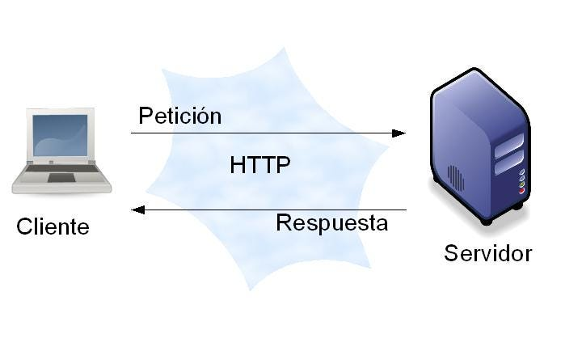
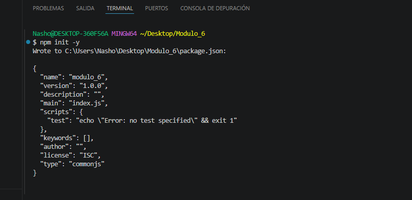
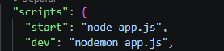
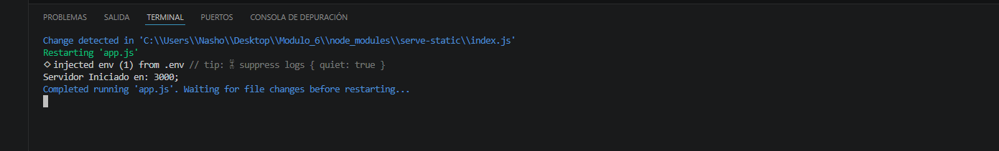
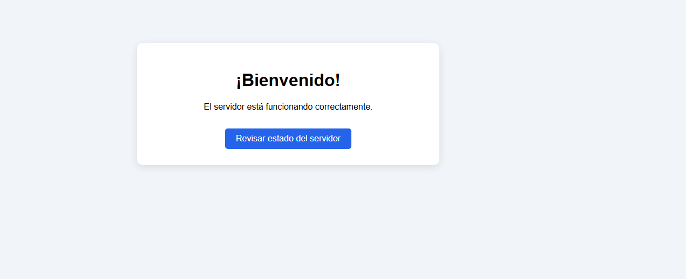
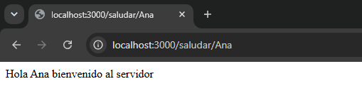
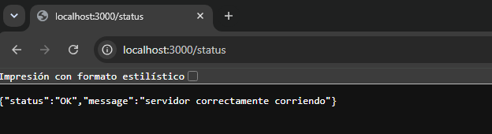
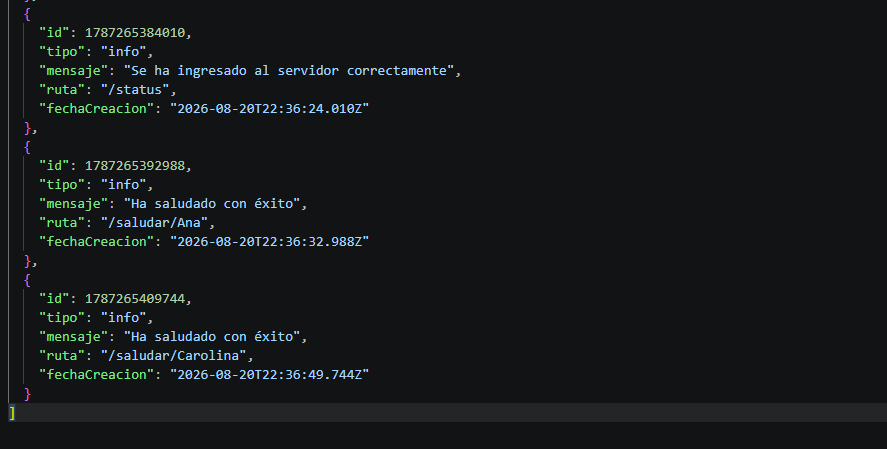

# Servidor web con Node.js y Express
## Ecosistema Node.js

Node.js es un entorno que permite ejecutar JavaScript fuera del navegador. Se utiliza principalmente para desarrollar servidores, APIs REST, aplicaciones web, servicios en tiempo real y herramientas de línea de comandos.

Su ecosistema incluye **npm**, que permite instalar y administrar librerías como:

- Express
- EJS
- Nodemon
- dotenv

## ¿Qué aporta Express sobre Node.js puro?

Express es un framework que simplifica la creación de servidores con Node.js. Facilita las siguientes tareas:

- Definir rutas.
- Manejar peticiones y respuestas.
- Utilizar middleware.
- Servir archivos estáticos.
- Integrar motores de plantillas como EJS.

### Ejemplo de una ruta con Express

La siguiente ruta responde con un objeto en formato JSON para informar que el servidor funciona correctamente:

```js
app.get("/status", (req, res) => {
	res.status(200).json({
		status: "OK",
		message: "Servidor correctamente corriendo",
	});
});

```
### Esquema cliente-servidor

El siguiente esquema representa la comunicación entre el cliente y el servidor mediante peticiones y respuestas HTTP.




En esta actividad se desarrolló un servidor web utilizando Node.js y Express. Se configuraron rutas, plantillas EJS, archivos estáticos y un sistema para registrar logs en formato JSON.

## 1. Inicialización del proyecto

Se inició el proyecto mediante `npm init`, generando el archivo `package.json` para administrar las dependencias y los scripts de ejecución.



## 2. Configuración del entorno de desarrollo

Se configuró el script `start:dev` para ejecutar el servidor utilizando Nodemon. Esto permite reiniciar automáticamente la aplicación cuando se realizan cambios en el código.



## 3. Inicio del servidor

Se creó e inició el servidor de Express, mostrando en la terminal el puerto y la dirección en la que se encuentra disponible.



## 4. Página de bienvenida con EJS

Se instaló y configuró EJS como motor de plantillas para mostrar una página de bienvenida. También se configuró la carpeta `public` para utilizar archivos estáticos como CSS, imágenes y JavaScript.



## 5. Ruta de saludo

Se creó la ruta dinámica `/saludar/:nombre`, la cual obtiene el nombre desde los parámetros de la URL y entrega un saludo personalizado al usuario.



## 6. Ruta de estado del servidor

Se implementó la ruta `/status`, que entrega una respuesta en formato JSON para indicar que el servidor está funcionando correctamente.



## 7. Registro de logs

Se desarrolló un sistema de logs utilizando el módulo `fs` de Node.js. Cada registro guarda un identificador, el tipo de log, un mensaje, la ruta utilizada y la fecha de creación.



## Requisitos del sistema

Para instalar y ejecutar el proyecto se necesita:

- Node.js instalado.
- npm, incluido con la instalación de Node.js.
- Un editor de código como Visual Studio Code.
- Una terminal o consola de comandos.
- Un navegador web.
- Nodemon para ejecutar el servidor durante el desarrollo.

## Instrucciones de instalación

### 1. Descargar el proyecto

Descargar o clonar el repositorio y abrir la carpeta del proyecto en Visual Studio Code.

```bash
git clone URL_DEL_REPOSITORIO
cd nombre-del-proyecto
```

### 2. Instalar las dependencias

Ejecutar el siguiente comando desde la carpeta principal del proyecto:

```bash
npm install
```

Este comando instalará automáticamente las dependencias registradas en el archivo `package.json`, como Express, EJS, Nodemon y dotenv.

### 3. Ejecutar el servidor

Para iniciar el proyecto en modo de desarrollo, ejecutar:

```bash
npm run dev
```

También se puede iniciar normalmente utilizando:

```bash
npm start
```

### 4. Abrir la aplicación

Una vez iniciado el servidor, se puede acceder a las siguientes rutas desde el navegador:

- Página principal: `http://localhost:3000/`
- Estado del servidor: `http://localhost:3000/status`
- Ruta de saludo: `http://localhost:3000/saludar/Raul`

Para detener el servidor, se debe presionar `Ctrl + C` en la terminal.
