# Gestión de usuarios con PostgreSQL y Sequelize ORM

En esta actividad se desarrolló una aplicación para gestionar usuarios utilizando Node.js, Express, PostgreSQL y Sequelize como ORM.

Se implementaron operaciones para crear, consultar, actualizar y eliminar usuarios. También se incorporaron transacciones para proteger operaciones relacionadas y una relación entre los modelos `Usuario` e `Historial`.

## 1. Creación de la base de datos

Primero se creó una base de datos en PostgreSQL para almacenar la información utilizada por la aplicación.

Posteriormente, Sequelize se encargó de sincronizar los modelos y generar las tablas correspondientes. La tabla principal utilizada en el proyecto es `usuarios`.

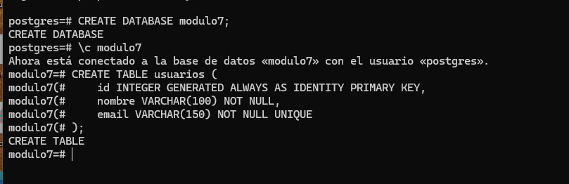

## 2. Conexión con PostgreSQL mediante Sequelize

La conexión con PostgreSQL se configuró mediante Sequelize. Las credenciales necesarias se almacenaron en variables de entorno para evitar que datos sensibles, como el usuario y la contraseña, quedaran escritos directamente en el código.

Antes de iniciar el servidor se comprueba que la conexión con la base de datos funcione correctamente. Si la conexión falla, el servidor informa el error y no continúa con su inicialización.

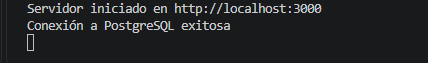

## 3. Organización modular del proyecto

El proyecto fue desarrollado utilizando una estructura modular. Esto permite separar las responsabilidades de la aplicación en diferentes carpetas y archivos.

La organización se distribuye de la siguiente manera:

- La carpeta `config` contiene la configuración de Sequelize y la conexión con PostgreSQL.
- La carpeta `models` contiene los modelos `Usuario` e `Historial`.
- El archivo `relaciones.js` contiene la relación entre los modelos.
- La carpeta `controllers` contiene la lógica para consultar, actualizar, eliminar y crear registros.
- La carpeta `routes` contiene las rutas disponibles.
- La carpeta `helpers` contiene funciones auxiliares utilizadas por la aplicación.
- El archivo `app.js` configura Express, los middleware y las rutas.
- El archivo `server.js` comprueba la conexión, sincroniza los modelos e inicia el servidor.

Cuando llega una petición, la aplicación funciona de la siguiente manera:

1. El cliente realiza una petición HTTP.
2. La ruta identifica qué función del controlador debe ejecutarse.
3. El controlador recibe los datos de la petición.
4. El controlador utiliza un modelo de Sequelize para acceder a PostgreSQL.
5. Sequelize realiza la operación correspondiente en la base de datos.
6. El servidor devuelve una respuesta en formato JSON.

Esta organización facilita la lectura, el mantenimiento y la ampliación del proyecto.

## 4. Modelo Usuario

Se creó el modelo `Usuario` para representar los registros almacenados en la tabla `usuarios`.

Cada usuario contiene los siguientes datos:

- Un identificador generado automáticamente.
- Un nombre.
- Un correo electrónico.

El nombre y el correo son obligatorios. Además, el correo electrónico se configuró como único para evitar que dos usuarios tengan la misma dirección.

Sequelize utiliza este modelo para realizar operaciones sobre la tabla sin necesidad de escribir consultas SQL manualmente.

## 5. Creación de usuarios

La creación de usuarios se realiza mediante una función que recibe el nombre y el correo electrónico como parámetros.

Esto permite reutilizar la misma función para crear diferentes usuarios, evitando mantener datos fijos dentro de su implementación.

Para cumplir los requisitos de la actividad, se crearon al menos tres registros simulados.

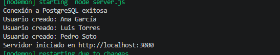

## 6. Consulta de usuarios

Se implementó la ruta `GET /usuarios`, encargada de consultar los usuarios almacenados en PostgreSQL mediante Sequelize.

Antes de enviar la respuesta, se seleccionan solamente los campos necesarios y se ordenan los resultados por su identificador.

La respuesta contiene la cantidad total de usuarios y un arreglo con los registros encontrados.

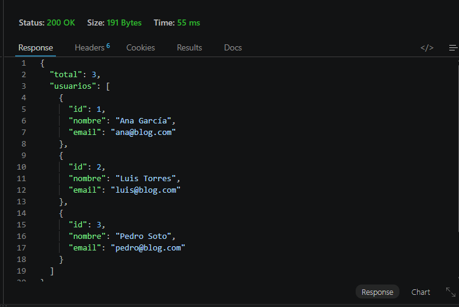

El resultado se devuelve en formato JSON, lo que permite utilizarlo fácilmente desde una aplicación web, Postman u otro cliente.

## 7. Actualización del correo de un usuario

Se creó la ruta `PUT /usuarios/:id` para actualizar el correo electrónico de un usuario.

El identificador se recibe mediante los parámetros de la URL, mientras que el nuevo correo se obtiene desde el cuerpo de la petición.

Antes de realizar la actualización, se comprueba que:

- El nuevo correo haya sido enviado.
- El usuario indicado exista en la base de datos.

Si el usuario existe, Sequelize actualiza su correo y devuelve el registro modificado. Si el usuario no existe, se entrega una respuesta indicando que no fue encontrado.

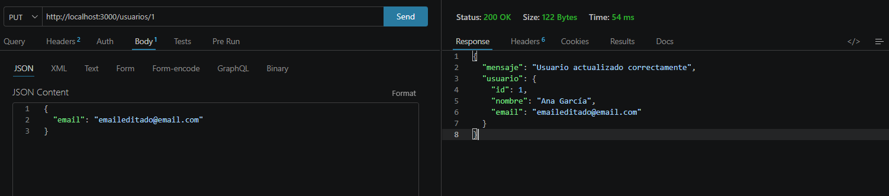

Después de modificar el registro, se utilizó nuevamente la ruta `GET /usuarios` para comprobar que el cambio se hubiera guardado correctamente.

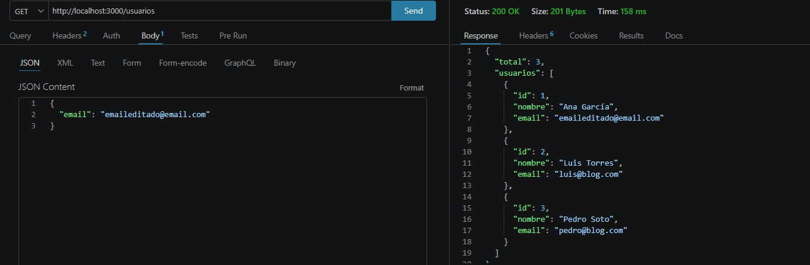

## 8. Eliminación de un usuario

Se implementó la ruta `DELETE /usuarios/:id` para eliminar un usuario mediante su identificador.

Antes de ejecutar la eliminación, el controlador busca al usuario en la base de datos. Si el registro existe, Sequelize lo elimina; si no existe, el servidor devuelve un mensaje indicando que no fue encontrado.

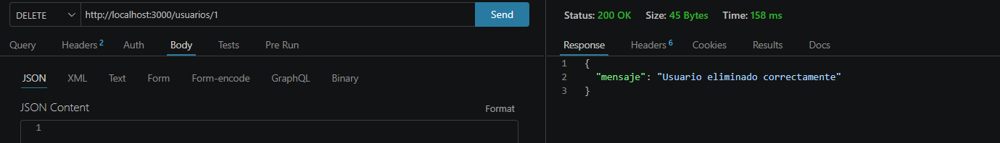

Luego se consultaron nuevamente los usuarios para comprobar que el registro eliminado ya no estuviera almacenado.

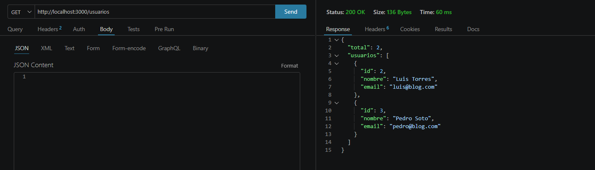

## 9. Modelo Historial

Se creó el modelo `Historial` para almacenar las acciones asociadas a los usuarios.

Cada registro del historial contiene:

- Un identificador generado automáticamente.
- Una descripción de la acción realizada.
- El identificador del usuario relacionado.

El campo `usuarioId` funciona como clave foránea y permite identificar a qué usuario pertenece cada registro del historial.

## 10. Transacción para crear un usuario y su historial

Se implementó una operación compuesta por dos acciones consecutivas:

1. Crear un usuario.
2. Crear un registro asociado en su historial.

Ambas acciones se ejecutan dentro de una misma transacción de Sequelize.

Si las dos operaciones se realizan correctamente, la transacción se confirma mediante `commit` y los registros quedan almacenados en la base de datos.

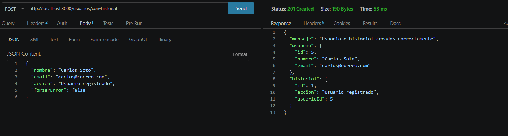

El resultado demuestra que el usuario y su historial fueron creados correctamente como parte de una misma operación.

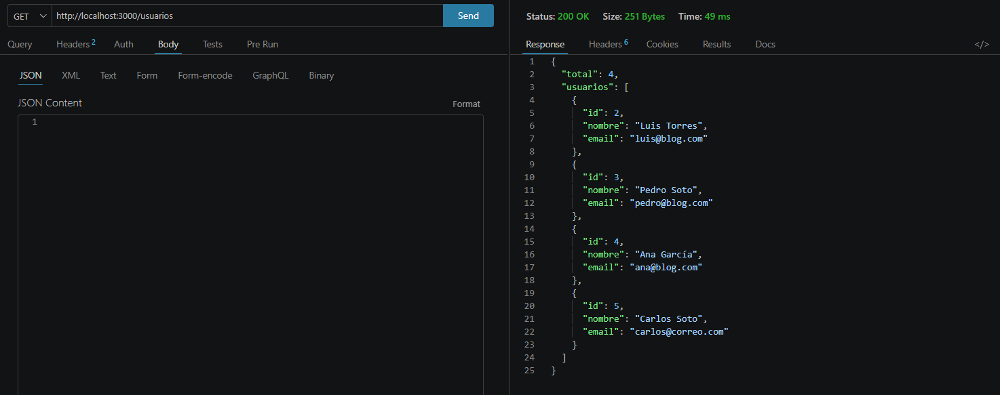

## 11. Prueba de rollback

Para comprobar el funcionamiento de la transacción, se agregó la posibilidad de provocar un error después de crear temporalmente al usuario y antes de guardar su historial.

Cuando se produce este error, Sequelize ejecuta un `rollback`. Esto deshace la creación del usuario y evita que quede información incompleta en la base de datos.

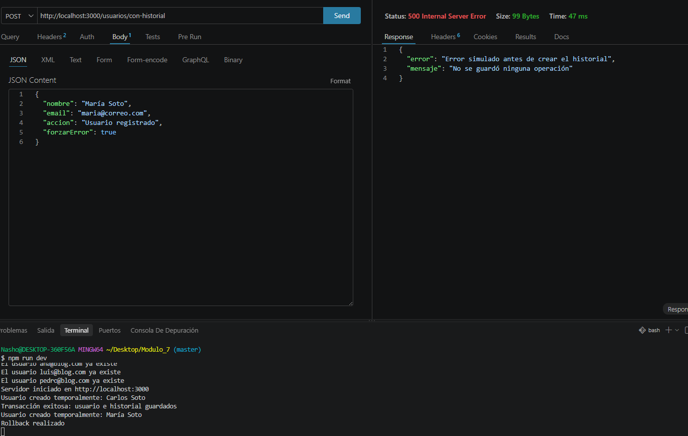

La prueba permite demostrar que:

- Si ambas operaciones funcionan, los datos quedan almacenados.
- Si una de las operaciones falla, se revierten todos los cambios.
- No queda un usuario creado sin su historial correspondiente.
- La base de datos mantiene la consistencia de la información.

## 12. Relación entre Usuario e Historial

Se estableció una relación uno a muchos entre los modelos `Usuario` e `Historial`.

Esta relación significa que:

- Un usuario puede tener varios registros en su historial.
- Cada registro del historial pertenece a un solo usuario.
- La relación se establece mediante la clave foránea `usuarioId`.
- Los historiales pueden eliminarse en cascada cuando se elimina el usuario relacionado.

Las relaciones fueron definidas en el archivo `relaciones.js`. Esto permite mantener la configuración de las asociaciones separada de los modelos y los controladores.

## 13. Consulta de un usuario con sus historiales

Se creó la ruta `GET /usuarios/:id/historiales` para consultar un usuario junto con todos sus historiales relacionados.

La consulta utiliza la opción `include` de Sequelize. Esta opción permite incorporar los registros relacionados dentro del resultado principal.

De esta manera, se obtiene la información del usuario y sus historiales en una sola respuesta JSON.

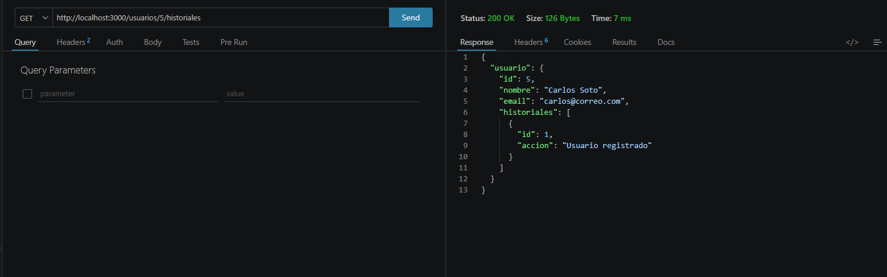

Si el usuario existe, pero todavía no tiene historiales, la ruta devuelve los datos del usuario junto con un arreglo de historiales vacío.

Esta implementación cumple con los requisitos de utilizar al menos dos modelos relacionados y consultar la relación mediante un ORM.

## 14. Comparación entre SQL manual y Sequelize ORM

Una consulta SQL manual requiere escribir directamente instrucciones como `SELECT`, `INSERT`, `UPDATE` y `DELETE`.

En este proyecto se utilizó Sequelize ORM, que permite realizar las mismas operaciones mediante modelos y métodos de JavaScript.

Los principales métodos de Sequelize utilizados fueron:

- `findAll()` para consultar varios usuarios.
- `findByPk()` para buscar un usuario por su identificador.
- `create()` para crear usuarios e historiales.
- `update()` para actualizar registros.
- `destroy()` para eliminar usuarios.
- `include` para consultar modelos relacionados.
- `transaction()` para controlar operaciones que deben ejecutarse juntas.

Tanto SQL manual como Sequelize permiten obtener resultados equivalentes. Sin embargo, Sequelize facilita la organización del proyecto porque permite trabajar mediante modelos y métodos de JavaScript.

La comparación con SQL se presenta solamente de manera explicativa, ya que todas las operaciones de esta aplicación fueron desarrolladas utilizando Sequelize ORM.

## 15. Manejo de errores

Las operaciones utilizan bloques `try...catch` para controlar posibles errores durante las consultas.

La aplicación puede responder ante situaciones como:

- Problemas de conexión con PostgreSQL.
- Usuarios que no existen.
- Datos obligatorios que no fueron enviados.
- Errores al crear, actualizar o eliminar registros.
- Fallos durante una transacción.

Esto permite entregar respuestas claras y evita que la aplicación se cierre inesperadamente cuando ocurre un problema.

## Rutas disponibles

| Método | Ruta | Descripción |
|---|---|---|
| `GET` | `/usuarios` | Obtiene todos los usuarios |
| `PUT` | `/usuarios/:id` | Actualiza el correo de un usuario |
| `DELETE` | `/usuarios/:id` | Elimina un usuario |
| `POST` | `/usuarios/con-historial` | Crea un usuario y su historial dentro de una transacción |
| `GET` | `/usuarios/:id/historiales` | Obtiene un usuario junto con sus historiales |

## Requisitos del sistema

Para instalar y ejecutar el proyecto se necesita:

- Node.js.
- npm.
- PostgreSQL.
- Una base de datos creada en PostgreSQL.
- Sequelize como ORM.
- El controlador `pg` para conectar Sequelize con PostgreSQL.
- Express para crear el servidor y administrar las rutas.
- dotenv para utilizar variables de entorno.
- Nodemon para ejecutar el servidor durante el desarrollo.
- Visual Studio Code o un editor equivalente.
- Postman o una herramienta similar para probar las rutas.

Las dependencias principales utilizadas en el proyecto son:

- `express`
- `sequelize`
- `pg`
- `pg-hstore`
- `dotenv`
- `ejs`

Como dependencia de desarrollo se utiliza:

- `nodemon`

Las credenciales de conexión con PostgreSQL deben almacenarse dentro de un archivo `.env`.

Las variables utilizadas son:

- `DB_NAME`: nombre de la base de datos.
- `DB_USER`: usuario de PostgreSQL.
- `DB_PASSWORD`: contraseña de PostgreSQL.
- `DB_HOST`: dirección del servidor de PostgreSQL.
- `DB_PORT`: puerto utilizado por PostgreSQL.
- `PORT`: puerto utilizado por Express.

El archivo `.env` debe agregarse a `.gitignore` para evitar que las credenciales sean publicadas en el repositorio. También se debe excluir la carpeta `node_modules`.

